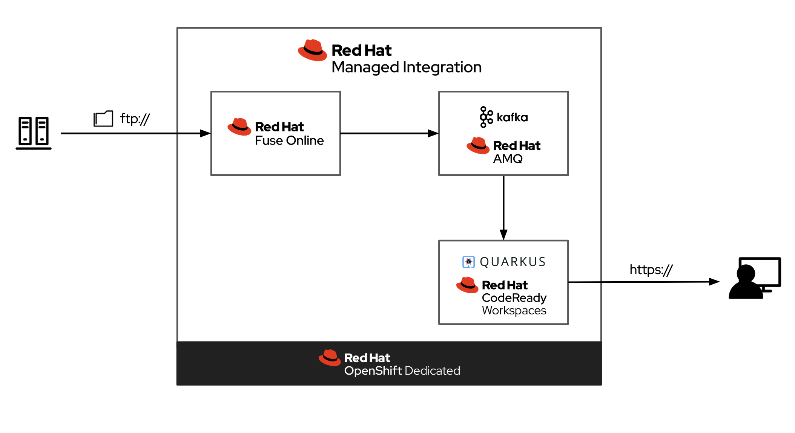

# Red Hat Managed Integration @ Red Hat Summit Keynoye 2020

This is the demo used as part of the Keynote at Red Hat Summit 2020. The demo
can be seen just after the 7 minute mark in
[this video](https://www.pscp.tv/w/1ynJOppLNeWxR).

## Overview

This demo uses the numerous products that are included with Red Hat Managed
Integration to demonstrate an enterprise integration scenario where:

* XML files are ingested from a legacy FTP service via Fuse Online
* Fuse Online process the XML into JSON and writes the results to a Kafka Topic
* A Quarkus application is run in dev mode using CodeReady Workspaces
* The Quarkus application consumes the JSON from Kafka and streams it to web UI

A simplified architecture diagram (excludes networking, load balancing etc.) is
included below for reference.



## Prerequisites

* OpenShift or OpenShift Dedicated 4.2+ Cluster
* Red Hat Managed Integration (aka [Integreatly](https://github.com/integr8ly/integreatly-operator/)) installed on the cluster

## Setup

Complete the instructions in the [ftp/README.md](/ftp/README.md) file of this repository first.
An FTP server populated with correctly formatted XML files is required for the
demo to function.

Once the FTP server and data generation is setup you are ready to setup the
OpenShift project and AMQ Streams:

```bash
# login to your openshift cluster
oc login $CLUSTER_URL

# run the setup script
./setup.sh
```

After the setup script has run you'll still have a couple of manual steps to
complete. These are covered in the two sections that follow:

### Import the Fuse Online Integration

1. Open the Fuse Online instance on the cluster.
1. Choose *Integrations* from the side menu.
1. Click the *Import* button.
1. Drag and Drop the ZIP file in the [fuse-online/ folder](/fuse-online) into the import upload area.
1. Navigate to the *Connections* screen in Fuse Online.
1. Update the *FTP* connection details with your FTP hostname, user, and password.
1. Return to the *Integrations* screen and edit and publish the FTP integration.

### Create a Workspace in CodeReady

1. Open CodeReady workspaces on the cluster.
1. Choose to create a new workspace.
1. From the options choose Java Spring Boot, but do not proceed yet.
1. In the top-right use the down arrow on the green button to edit the configuration.
1. Paste in the contents of this [code-ready/devfile.yml](/code-ready/devfile.yml).
1. Create the workspace.

## Showcasing the Demo

1. Open the Quarkus CodeReady Workspace.
1. From the command palette on the right choose "run".
1. Wait for the application to start.
1. When prompted with notifications about ports available:
    * Dismiss the port 5005 notification.
    * Open the URL when prompted by the port 8080 notification.

Marvel at the Transactions UI that's displayed and table rows being populated
dynamically with data from the FTP server that's routed through Kafka.